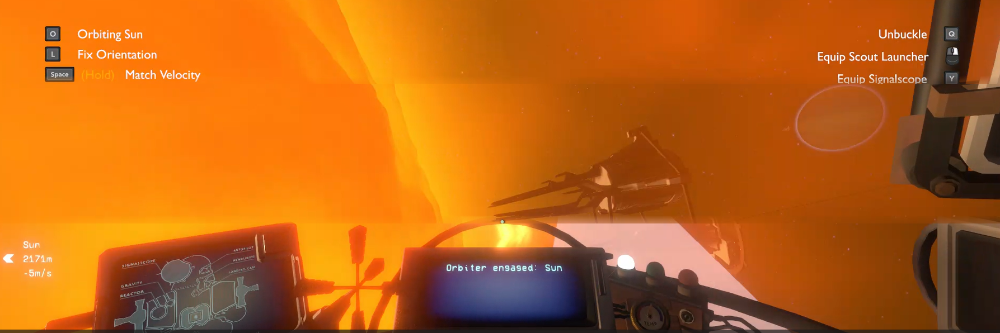

# Orbiter

Circularize and hold your ship's orbit around a planet or moon, hands off the stick.

## Features
- Press `O` to circularize and hold your current orbit
- Press `L` to lock the ship's nose pointing at the orbited body
- Tilt the orbit's plane live with `[`/`]` and `'`/`;`
- Faint on-screen ring shows the orbit path you're holding
- Works even after unbuckling - the ship keeps orbiting on its own
- Grabbing the stick (translation or rotation) hands control back to you immediately

View the mod's settings (`Mods > Orbiter`) to tune response time, deadband, minimum fuel, engage range, and more.
